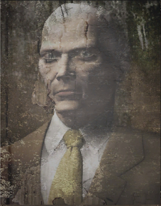

# James Marcus
James Marcus | Bio
------------ | ------------
| A founding partner of Umbrella, and first director of the Umbrella Training Facility. Marcus was assassinated as part of a power struggle, but mysteriously came back to life as a younger version of himself 10 years later in 1998, plotting his revenge on Umbrella and the destruction of the world itself.

## Sources
1. https://www.residentevil.net/recollections/dw215.html?l=en
