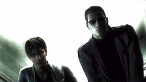
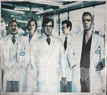

# Prologue

## Contents

+ [Natural History](#natural-history)
+ [Dark Ambitions](#dark-ambitions)
+ [Patient Zero](#patient-zero)
+ [Umbrella Corporation](#umbrella-corporation)
+ [Project Code Veronica](#project-code-veronica)
+ [Spencer Secret Project](#spencer-secret-project)
+ [The Prodigies](#the-prodigies)
+ [T-Virus](#t-virus)

## Natural History

In the 19th century, a european explorer named Henry Travis, through many years of exploring Africa, dedicated 35 years of his life analysing and cataloging fauna, flora and, the culture of the people of Africa.

In his book, Survey of Natural History, he talked about a expedition that occurred in West Africa, in the Kijuju region where he found a rare flower known as the Stairway of the Sun also known by his the scientific name Sonnentreppe.

Stairway to the Sun           |  Sun Garden
:-------------------------:|:-------------------------:
  |  

The flower was found in the ruins of an extinct Kingdom Ndipaya in a underground garden called Sun Garden.

What was so special about the rare flower is that it was not only toxic to most who consumed which were caused by a virus infection but under special circumstances, those who survive the infection gained
superhuman strength and intelligence.

The historical value and economic of Survey of Natural History was contested by the scientific community which led to  Henry and his book being seen as fraud. Due to his book failure, Henry died from a deep depression.

## Dark Ambitions

In the 1960s, three virologists and longtime friends, [Ozwell E. Spencer](characters/ozwell-spencer.md), [Edward Ashford](characters/edward-ashford.md) and [James Marcus](characters/james-marcus.md) upon learning about the virus through Travis's works, they rediscovered the flowers in West Africa in an ancient stone garden protect by an ancient African tribe known as Ndipaya.

Edward comes from the noble Ashford Familty. Professor Marcus is, perhaps, the most brilliant of the three. Spencer is the wealthiest.

The tribe ritualistically eat the flowers and whoever resisted the effects upon its consumption was declared the strongest man and was appointed chief.

[Spencer](characters/ozwell-spencer.md), [Ashford](characters/edward-ashford.md) and [Marcus](characters/james-marcus.md) knowning each other since college, shared the ideals of using the virus to create a new generation of educated superhumans that would pioneer a new age.

[Marcus](characters/james-marcus.md) and his student Brandon Bailey made preparations to leave Africa with a sample to begin research immediately. The virus was named Progenitor. They concluded that the mass-cultivated flowers were not able to produce the virus due to the local environmental factors necessary upon cultivation.

Bailey returns to Africa where he can send remittances of the Progenitor to [Marcus](characters/james-marcus.md).

Upon realizing the value of the flowers, [Spencer](characters/ozwell-spencer.md) used his influence to control the region of extration of the plant and got rid of the descendents of the Ndipaya tribe.

It's in this period that the divergence of objectives and ideals between the old friends began to appear. [Spencer](characters/ozwell-spencer.md) and [Edward](characters/edward-ashford.md) were very ambitious and wanted power and wealth as results of their discoveries. [Marcus](characters/james-marcus.md) was obsessed with science and only care about studying the virus.

[Spencer](characters/ozwell-spencer.md) had plans of his own where he had the vision to remake the world creating a superior race of humans and make himself as his ruler.

## Patient Zero

During this time, [Spencer](characters/ozwell-spencer.md) began construction on a mansion in the Arklay Mountains the would also serve as a secret Umbrella laboratory. [George Trevor](characters/george-trevor.md) was the architect responsible for the design and the construction of the mansion. [Spencer](characters/ozwell-spencer.md) admired his surreal designs.

Spencer Mansion - Outside View|
------------ |
 |

Upon the completion of the mansion in 1967, [Spencer](characters/ozwell-spencer.md) realised that [Trevor](characters/george-trevor.md) was aware of the laboratory and knew too much and began making plans for disposing him. He invited [Trevor](characters/george-trevor.md), his wife [Jessica](characters/jessica-trevor.md) and his 14 years old daughter [Lisa](characters/lisa-trevor.md) to the house to celebrate the completion of the Spencer Mansion. [Spencer](characters/ozwell-spencer.md) planned to use them as test subjects in his Progenitor research.

[Trevor](characters/george-trevor.md) was busy with work at the time and sends his wife and daughter, [Jessica](characters/jessica-trevor.md) and [Lisa](characters/lisa-trevor.md) to travel first to the Spencer Mansion. Unfortunally upon arrivel, Jessica and Lisa are imprisoned in the secret laboratory built under the mansion.

When [Trevor](characters/george-trevor.md) finally arrived at the Spencer Mansion, he didn't find his family. [Spencer](characters/ozwell-spencer.md) had told him the they have left due to an news regarding a sick aunt.

[Trevor](characters/george-trevor.md) is also imprisoned but manages to escape his confinement and runs into the underground tunnels. With no chance of escaping, he stumbles upon a tombstone with his name written on it. Being desperate, exhausted and starving for days, [Trevor](characters/george-trevor.md) dies alone in the tunnels.

[Jessica](characters/jessica-trevor.md) and [Lisa](characters/lisa-trevor.md) suffer as test subjects. Spencer's scientists creats two variations of the Progenitor Virus. [Jessica](characters/jessica-trevor.md) received sample Type-A, which causes a terrible reaction and results in her death. [Lisa](characters/lisa-trevor.md) received sample Type-B and her body surprisingly adapts to the virus. The girl is kept isoladed and under surveillance.

[Lisa](characters/lisa-trevor.md) received a new dose of the Progenitor and as side-effect, she began losing her sanity and suffered severes physical deformaties. She also gained an uncommon physical strength and accelerated regenerative capabilities.

## Umbrella Corporation

In 1968, [Ozwell E. Spencer](characters/ozwell-spencer.md) creates the Umbrella Corporation which would initially operate in the pharmaceutical sector with his headquarters established in Europe.

Umbrella - "Our Business is Life Itself..."|
------------ |
|

[Spencer](characters/ozwell-spencer.md) orders in secret, construction of a complex next to the Sun Garden, in Africa, to create more samples of the Progenitor.

A Umbrella Executive Training Facility  is established in Raccoon City, in the Arklay Mountains, to train scientists and special employees for Umbrella. [Marcus](characters/james-marcus.md), reluctantly accepts the position as director of the Umbrella Executive Training Facility.

Umbrella Executive Training Facility - Arklay Mountains |
------------ |
|

Soon after the creation of Umbrella, [Edward Ashford](characters/edward-ashford.md) dies due to exposure of the Progenitor Virus. As result of his death, [Spencer](characters/ozwell-spencer.md) gains more influence and power inside the company.

Edward's son, [Alexander Ashford](characters/alexander-ashford.md), continues his father's research and sees the power and influence of the Ashford Family inside Umbrella diminish which ruined the name of the family in european aristocracy.

[Alexander](characters/alexander-ashford.md) uses his knowledge in genetics engineering and orders the construction of a Antartic Installation, where he would work in a private project  without [Spencer](characters/ozwell-spencer.md) awareness called Project Code: Veronica.

## Project Code Veronica

[Alexander Ashford](characters/alexander-ashford.md) wasn't a natural born leader and he desired to be like his ancester, [Veronica Ashford](characters/veronica-ashford.md). The matriarch was a woman ahead of her time, beautiful and extremelly intelligent.

With his knowledge in genetics engineering, [Alexander](characters/alexander-ashford.md) made a notable discovery in identifying the human gene responsible for intelligence.

[Alexander](characters/alexander-ashford.md) combines his DNA with [Veronica's](characters/veronica-ashford.md) mummified body, which was kept by the family. He fertilizes an egg with various genetic improvements in the attempt of cloning the matriarch. The Project in concluded in 1971 and two twins are born: [Alexia](characters/alexia-asford.md) and [Alfred](characters/alfred-asford.md).

[Alfred](characters/alfred-asford.md) displayed a above average intelligence where [Alexia](characters/alexia-asford.md) had an extraordinary potential. She was hired by Umbrella as the lead researcher after graduating from university at the age of 10.

## Spencer Secret Project

[Spencer](characters/ozwell-spencer.md) begins his secret research inside of Umbrella named Project W (or Project Wesker), where hundred of children born from parents with "superior intellect" would be collected for the experiment.

For the selected children, their personalities would be molded, with every children receiving the best education and at the same time have a relatively normal life without realizing that they are being monitored 24 hours a day.

Years later, the Wesker Children, received a new dose of an prototype virus based in the Progenitor. Many died but among the few survivors is a young boy called [Albert Wesker](characters/albert-wesker.md).

## The Prodigies
During the 70s, Umbrella's power increased in the pharmaceutical sector. [Spencer](characters/ozwell-spencer.md) being the president and absolute leader of the corporation, had a network of contacts featuring very important people from various segments of the world economy and politics.

[James Marcus](characters/james-marcus.md) while working obsessively on the Progenitor Research in the executive training facility, entered in disagreement with [Spencer](characters/ozwell-spencer.md) due to his work not bringing results and making high expenses to the company.

In September 1977, 2 young scientists joined the training facility research team:  [William Birkin](characters/william-birkin.md) and [Albert Wesker](characters/albert-wesker.md). They are hired to trained virology as personal assistents of [James Marcus](characters/james-marcus.md).

William Birkin and Albert Wesker |
------------ |
 |

In the end of July following year, the training facility was closed but [Marcus](characters/james-marcus.md) still remained working in the facility. [Wesker](characters/albert-wesker.md) and [William](characters/william-birkin.md) are transfered along with a good part of the research to the Arklay Installation.

## T-Virus

In September 1978, [Marcus](characters/james-marcus) finally was able to create a stable variant of the Progenitor, he names it Tyrant virus or T-virus for short, which was capable of causing mutation in a cellular level. [Spencer](characters/ozwell-spencer.md) finds out about the discovery and was able to acquire a sample which was later sent to the European division for studies.

[Marcus](characters/james-marcus.md) after finding out about the betrayal, becomes furious. In the same year, [William](characters/william-birkin.md) and [Wesker](characters/albert-wesker.md) discover the existence of [Lisa Trevor](characters/lisa-trevor.md) and her incredible immunological power.

In 1981, the Arklay Installation research team starts the second phase of the t-virus tests.

Arklay Research Team |
------------ |
 |

## Sources
1. [As Grandes Historias de Videogames - Resident Evil Parte 1](https://www.amazon.com/Grandes-Hist%C3%B3rias-Videogames-Resident-Evil/dp/8579602769)
2. [Resident Evil Fandom](https://residentevil.fandom.com/)
3. [Resident Evil Timeline](https://www.youtube.com/watch?v=bXMmCi1iQSQ&frags=wn&ab_channel=SuggestiveGaming)
4. [Resident Evil 1 Explained Lore Drop Remaster](https://www.youtube.com/watch?v=LDK7cIc_U1Q&ab_channel=SuggestiveGaming)
5. [Resident Evil The Story so far](https://www.youtube.com/watch?v=LDK7cIc_U1Q&ab_channel=SuggestiveGaming)
6. [Timeline The Complete Resident Evil the Complete Resident Evil Story Explained](https://www.gamespot.com/articles/timeline-the-complete-resident-evil-story-explaine/1100-6476213/)
7. [Resident Evil Database](http://www.residentevildatabase.com/)
